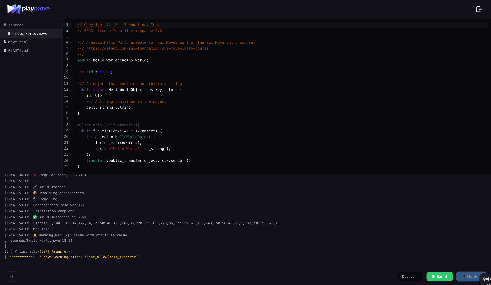

<p align="center">
  
</p>

# PlayMove

A playground for Move — pick a template or import from GitHub, build and deploy to Sui in seconds.

**Build, Deploy & Play**

## Features

- 28 Move contract templates (sui-move-intro-course + MystenLabs examples)
- Import Move projects from GitHub (public & private repos)
- CodeMirror editor with syntax highlighting
- WASM-based Move compiler (no backend needed)
- Deploy to Sui via wallet (devnet / testnet / mainnet)
- Dark theme, mobile-friendly

## How to Use

### 1. Pick a template or import from GitHub

Choose from 28 built-in Move templates, or paste a GitHub URL to import your own project.


### 2. Edit in the playground

Browse files in the sidebar, edit code with syntax highlighting.


### 3. Build & Deploy

Hit **▶ Build** to compile with the WASM Move compiler. Connect your wallet and click **🚀 Deploy** to publish on-chain.



## Tips

> **GitHub import rate limit** — GitHub API has a 60 req/hour limit for unauthenticated requests. Click the 🔑 button next to the import field and add a [Personal Access Token](https://github.com/settings/tokens) to raise the limit.

> **Network mismatch** — When deploying, make sure the network selected in PlayMove (devnet / testnet / mainnet) matches your wallet's active network. A mismatch may cause the transaction to fail.

## Tech Stack

- React + Vite + TypeScript
- CodeMirror 6 (`@codemirror/lang-rust`, `@codemirror/lang-yaml`)
- `@zktx.io/sui-move-builder/lite` — WASM Move compiler
- `@mysten/dapp-kit` + `@mysten/sui` — wallet & transactions

## Getting Started

```bash
npm install
npm run dev
```

## Scripts

| Command | Description |
|---------|-------------|
| `npm run dev` | Start dev server |
| `npm run build` | Type-check & build for production |
| `npm run preview` | Preview production build |
| `npm run lint` | Run ESLint |
| `npm run format` | Format with Prettier |

## License

MIT
