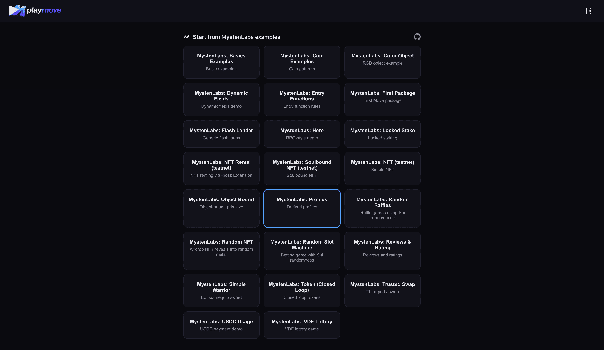
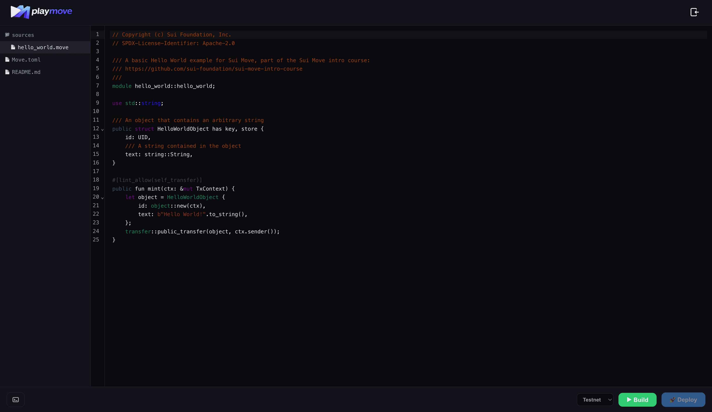
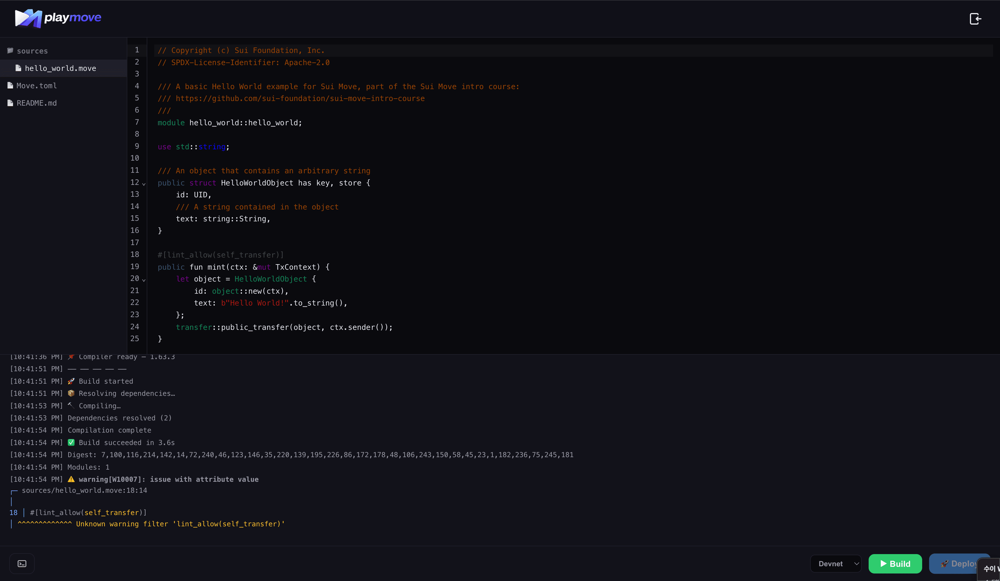

<p align="center">
  
</p>

# PlayMove

A lightweight, web-based Move playground for Sui.

Load Move projects from GitHub or start from a template, make quick edits, compile in the browser with a WASM-based compiler, and deploy contracts on-chain — all without any local setup.

**Build, Deploy & Play**

https://github.com/user-attachments/assets/49ecb503-04d1-46dd-b531-e456989780b1

## Features

- 28 Move contract templates (sui-move-intro-course + MystenLabs examples)
- Import one Move package from GitHub (public repos, or private repos with a session token)
- CodeMirror editor with syntax highlighting
- WASM-based Move compiler (no backend needed)
- Deploy to Sui via wallet (devnet / testnet / mainnet)
- No local toolchain required
- Dark theme, mobile-friendly

## How to Use

### 1. Pick a template or import from GitHub

Choose from 28 built-in Move templates, or paste a GitHub URL to import your own project.



### 2. Edit in the playground

Switch between the small set of surfaced files, edit code with syntax highlighting, and keep the rest included in builds.



### 3. Build & Deploy

Hit **▶ Build** to compile with the WASM Move compiler. Connect your wallet and click **🚀 Deploy** to publish on-chain.



## Tips

> **GitHub import rate limit** — GitHub API has a 60 req/hour limit for unauthenticated requests. Click the 🔑 button next to the import field and add a fine-grained read-only token for this tab session to import private repos or raise the limit.

> **Network mismatch** — When deploying, make sure the network selected in PlayMove (devnet / testnet / mainnet) matches your wallet's active network. A mismatch may cause the transaction to fail.

## Tech Stack

- React + Vite + TypeScript
- CodeMirror 6 (`@codemirror/lang-rust`, `@codemirror/lang-yaml`)
- `@zktx.io/sui-move-builder/lite` — WASM Move compiler
- `@mysten/dapp-kit` + `@mysten/sui` — wallet & transactions

## Getting Started

```bash
npm install
npm run dev
```

## Scripts

| Command           | Description                       |
| ----------------- | --------------------------------- |
| `npm run dev`     | Start dev server                  |
| `npm run build`   | Type-check & build for production |
| `npm run preview` | Preview production build          |
| `npm run lint`    | Run ESLint                        |
| `npm run format`  | Format with Prettier              |

## License

MIT
